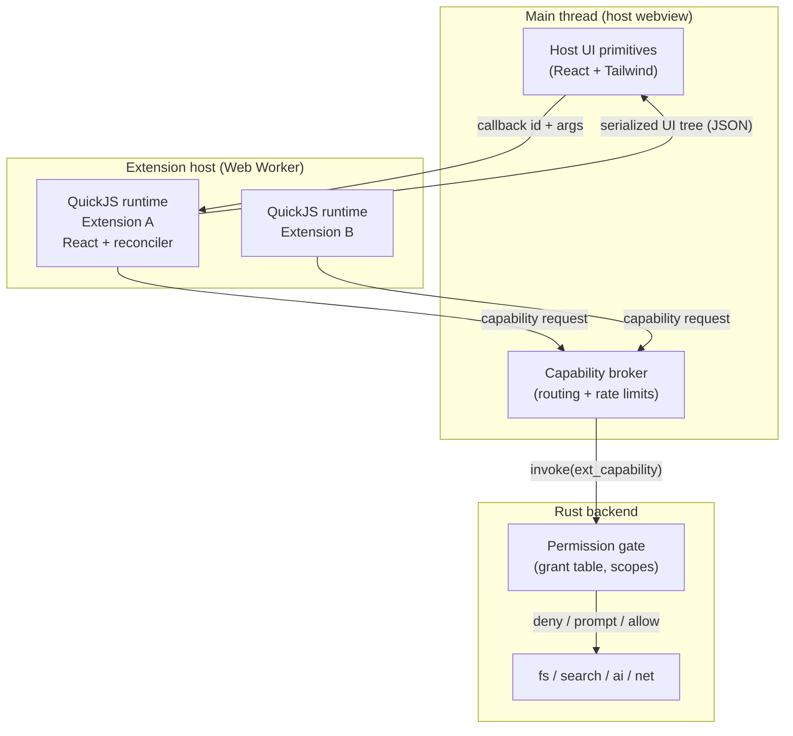

# Extensions System Spec

## Summary

A TypeScript extension system for Writer, modelled on Raycast's authoring experience but with real isolation. Extensions are authored in TypeScript/React, distributed from GitHub repositories, and execute inside a per-extension JavaScript VM that has **no ambient host access**. Every capability that touches the user's machine — reading notes, writing files, network, AI — is a host-provided function gated by a declared manifest permission and an explicit user grant enforced in Rust.

The design goal, stated plainly: **an installed extension must not be able to do anything harmful without the user having approved that specific class of action.**

## Verification Status

The two load-bearing technical bets were spiked before writing this plan, not assumed. All measurements below are from `quickjs-emscripten@0.32.0` + `react@19` + `react-reconciler@0.33.0` on this machine.

**Isolation spike — 8/8 pass:**

| Property                                                  | Result                                                                                      |
| --------------------------------------------------------- | ------------------------------------------------------------------------------------------- |
| Runaway `while(true)` halted by interrupt handler         | ✅ stopped at ~205ms against a 200ms deadline                                               |
| Guest heap memory cap enforced                            | ✅ allocation fails past `setMemoryLimit`                                                   |
| No ambient host globals                                   | ✅ `process`, `fetch`, `require`, `window`, `XMLHttpRequest`, `WebAssembly` all `undefined` |
| Host capability call + argument/return marshalling        | ✅                                                                                          |
| Module loader allow/deny                                  | ✅ `@writer/api` resolved, `node:fs` rejected (default-deny)                                |
| Async host bridge (host promise → guest `await`)          | ✅                                                                                          |
| Cross-runtime isolation (ext A global invisible to ext B) | ✅                                                                                          |
| Cost                                                      | `newRuntime + newContext` ≈ **0.20ms**; building a 50-item tree 200× ≈ **9–11ms**           |

**UI spike — pass.** A React extension bundled to 430KB was loaded into the VM and driven end to end:

- Parse + evaluate the React bundle inside the VM: **~40–46ms** (one-time, per extension launch)
- Mount + `useEffect` + host capability call + commit: **~65ms**
- Three commits crossed the boundary as JSON (`loading` → 4 items → filtered to 1)
- A host-side callback (`onSearchTextChange`) round-tripped into the guest and produced a correct re-render

**Conclusion: we do not have to trade the Raycast UI model against isolation.** React runs _inside_ the sandbox; only a serialized tree crosses out. Host functions were separately proven reusable (6/6 calls), so the capability model is sound.

### Hazards found during the spike (design constraints, not blockers)

These cost real debugging time and are now encoded as requirements:

1. **`ctx.dump()` does not deep-serialize object graphs** — it returns `"[object Object]"`. The guest must `JSON.stringify` explicitly. This is a feature, not a workaround: it forces one explicit serialization boundary.
2. **`react-reconciler` has unstable internals.** In 0.33 the signature is `commitUpdate(instance, type, oldProps, newProps, fiber)`; passing the wrong positional arg serialized React's internal fiber and produced a circular reference that silently broke every commit after the first. **Requirement:** pin the version exactly, and add a contract test that asserts a committed tree is JSON-serializable.
3. **Props must be allowlisted, not copied.** Only primitives, plain objects, arrays, and functions (converted to callback IDs) may cross. Everything else is dropped.
4. **There is no ambient event loop in the VM.** The host must pump `executePendingJobs()` and the reconciler's `flushPassiveEffects()`. Timers must be host-provided.
5. **Handles require manual disposal.** Leaking one aborts the WASM module on `dispose()` with a GC assertion. All handle use must go through a scope helper.
6. **WebKit enforces CSP for WebAssembly.** The app's original CSP produced `CompileError: Refused to create a WebAssembly object`. **Requirement:** `tauri.conf.json` must include `'wasm-unsafe-eval'` in `script-src` and `worker-src 'self'`. Workers inherit CSP from their _own_ response, not the parent document. Verified in the shipped WKWebView by `apps/desktop/e2e/specs/extension-vm.spec.js`.
7. **React 19 removed legacy mode.** The container must be created with `ConcurrentRoot`; a `LegacyRoot` tag never schedules updates. `updateContainer` alone still never renders inside the VM, so `resolveUpdatePriority` is pinned to `DiscreteEventPriority` to keep all work on the sync lane.
8. **React's scheduler binds its host callback at module init**, preferring `setImmediate`, then `MessageChannel`, then `setTimeout`. QuickJS has none of these, so the host **must** inject `setTimeout`/`clearTimeout` _before_ evaluating the bundle. Node's `setImmediate` masks this in tests; the test environment deletes it so the failure stays honest.
9. **QuickJS does not drain promise reactions when the host stack unwinds.** A capability can resolve with correct data and the guest's `.then` still never runs. The host must call `runtime.executePendingJobs()` after every guest entry point.
10. **In-flight capability calls are not "pending work".** They wait on the host, so a render-settling loop cannot advance them; counting them burns the whole loop budget on every render that has an outstanding request.
11. **Depth limits are not cycle detection.** A cycle nested within the depth limit produces a plausible-looking truncated copy instead of an error. Prop sanitization must track the path and reject the whole prop.

## Goals

- Extensions authored in TypeScript/React with a Raycast-style component API.
- Hard isolation: extensions cannot reach the host DOM, the host's Tauri IPC, the filesystem, or the network except through granted capabilities.
- Extension-to-extension isolation by default, with opt-in shared storage.
- Install directly from any GitHub repository; official extensions from a registry in this repo.
- Updates tracked against GitHub Releases of the extension's own repo.
- Private extensions = private repos; the installing user must have access.
- A first-party AI Chat extension that can search, read, and reason over the user's notes.

## Non-Goals

- Arbitrary HTML/CSS/JS extension UI. Extensions get host-owned primitives only. This is the deliberate constraint that makes the UI safe and keeps extensions visually consistent — the same trade Raycast makes.
- Native code / NPM native modules inside extensions.
- A paid marketplace, ratings, or telemetry.
- Extensions modifying the editor's core rendering pipeline (no CodeMirror extension injection in v1).

## Architecture



### Why this shape

**One dedicated Web Worker hosting N QuickJS runtimes.** This mirrors VS Code's extension host. The worker keeps runaway extension code off the UI thread (the interrupt handler bounds a loop at ~200ms, but that would still be a 200ms UI freeze on the main thread). `worker.terminate()` provides a hard kill when the cooperative interrupt is insufficient. Per-extension isolation comes from separate QuickJS runtimes, which are cheap (0.20ms) and provably cannot see each other's state; the 505KB WASM module is instantiated once and shared.

**The permission gate lives in Rust, not TypeScript.** The webview is not a trust boundary — Tauri's own docs are explicit that capabilities do not protect against malicious code with DOM/JS access in the same webview. Putting the check in Rust means that even a fully compromised webview cannot read a file the user never granted. The TS-side broker is an optimization and a UX layer, never the enforcement point.

**UI is host-rendered from a serialized tree.** The extension's React tree never becomes DOM. The host receives JSON and renders it with its own components, so an extension cannot inject markup, scripts, styles, or exfiltrate via an ``.

## Extension Authoring

### Manifest (`writer.json`)

```json
{
  "id": "ai-chat",
  "name": "AI Chat",
  "description": "Reason over your notes with GitHub Copilot.",
  "version": "1.0.0",
  "minWriterVersion": "0.5.0",
  "author": "darylcecile",
  "license": "MIT",
  "icon": "icon.png",
  "commands": [
    {
      "name": "ask",
      "title": "Ask Your Notes",
      "description": "Ask a question answered from your workspace.",
      "mode": "view",
      "surface": "panel"
    }
  ],
  "preferences": [
    {
      "name": "model",
      "type": "dropdown",
      "title": "Model",
      "default": "claude-sonnet-4.5",
      "data": [{ "title": "Claude Sonnet 4.5", "value": "claude-sonnet-4.5" }]
    }
  ],
  "capabilities": {
    "workspace": {
      "read": ["**/*.md"],
      "write": [],
      "reason": "Reads your notes to answer questions about them."
    },
    "ai": { "reason": "Sends selected note excerpts to GitHub Copilot." },
    "network": { "domains": [] },
    "storage": { "shared": [] }
  }
}
```

Design decisions, and why:

- **`capabilities` is a closed set with explicit scopes.** Following Figma's `networkAccess.allowedDomains` and Chrome's `host_permissions`: a domain allowlist, not a boolean. `"domains": []` means no network at all, which is the default.
- **`reason` is mandatory for any non-ambient capability** and is shown verbatim in the consent dialog. Figma requires this for wildcards; we require it for everything, because an unexplained request is a signal in itself.
- **Version is in the manifest and is the update key.** Obsidian's model: the release tag must equal `manifest.version`.
- **`minWriterVersion` gates installs** against API drift.

### Capability tiers

| Tier         | Capabilities                                                                              | Consent                                                  |
| ------------ | ----------------------------------------------------------------------------------------- | -------------------------------------------------------- |
| Ambient      | own storage, own preferences, UI render, log                                              | none — cannot touch user data                            |
| Install-time | `workspace.read` (glob-scoped), `network.domains` (explicit list), `ai`, `clipboard.read` | granted once at install, shown with reasons              |
| Runtime      | `workspace.write`, `workspace.delete`, `network.domains: ["*"]`, `shell`                  | prompted on first use, with "allow once / always / deny" |

**Scopes are enforced in Rust against the canonicalized real path**, after symlink resolution, and must remain inside the workspace root. A `read: ["**/*.md"]` grant cannot escape via `../` or a symlink into `~/.ssh`.

### Inter-extension services

The spec originally shared only _storage_ between extensions, which is not enough: the
semantic-index extension has to expose _query_ to AI Chat. A `services` capability closes
that gap.

- A provider declares `permissions.providesServices: ["search"]`.
- A consumer declares `permissions.usesServices: ["search"]`.
- The broker routes consumer → provider, and the user consents to the link at install time.

Two rules make this safe to add. A service call is **not** an authority grant: the provider
runs with its own permissions, never the caller's, so a consumer cannot borrow a capability
it was not granted. And a provider failure is delivered to the consumer as a normal refusal
(`{ ok: false, code }`), never as an exception, so one extension can never take another down.

**Embeddings are a Rust capability, not a library.** sqlite-vec is a native SQLite extension
and embedding inference is native code; neither can run in QuickJS. It is layered exactly
like `ai`: the guest sees an async capability, Rust owns the implementation.

### Guest API surface

```typescript
import { List, ActionPanel, Action, showToast, workspace, storage, ai } from "@writer/api";

export default function Command() {
  const [notes, setNotes] = useState<Note[]>([]);

  useEffect(() => {
    // Rejects at the Rust gate unless workspace.read was granted.
    workspace.search("tauri").then(setNotes);
  }, []);

  return (
    <List isLoading={!notes.length} onSearchTextChange={setQuery}>
      {notes.map((n) => (
        <List.Item
          key={n.path}
          title={n.title}
          subtitle={n.path}
          actions={
            <ActionPanel>
              <Action.OpenNote path={n.path} />
              <Action.CopyToClipboard content={n.path} />
            </ActionPanel>
          }
        />
      ))}
    </List>
  );
}
```

### UI primitives (host-owned)

Ported conceptually from Raycast, rendered with Writer's existing Tailwind/CSS-variable theming so extensions inherit the user's theme automatically:

- `List`, `List.Item`, `List.Section`, `List.EmptyView`, `List.Dropdown`
- `Detail` (markdown, rendered through the app's existing renderer + DOMPurify), `Detail.Metadata`
- `Form` + `TextField`, `PasswordField`, `TextArea`, `Dropdown`, `Checkbox`, `TagPicker`, `FilePicker`
- `Grid`
- `ActionPanel`, `Action`, `Action.Submenu`, and built-ins (`OpenNote`, `CopyToClipboard`, `OpenInBrowser`, `SubmitForm`, `Push`, `Pop`)
- Writer-specific: `Chat` (message list + composer + streaming), `NotePreview`

Feedback APIs: `showToast`, `showHUD`, `confirmAlert`, `useNavigation()`.

**Surfaces** an extension command can occupy: `palette` (existing cmdk palette), `panel` (right-hand dock), `sidebar` section, `editor-action` (context menu).

### Build toolchain

`writer-ext` CLI (thin wrapper over esbuild, following `ray build`):

- `writer-ext dev` — watch, rebuild, hot-reload into a running Writer with a `[dev]` badge
- `writer-ext build` — bundle to a single ESM `extension.js`, externalize `@writer/api`
- `writer-ext validate` — manifest schema, capability/reason completeness, bundle size, serializability contract test
- `writer-ext package` — emit release assets

Bundle output is exactly two required files: `manifest.json` and `extension.js`.

## Distribution and Updates

Deliberately Obsidian's model — **no CDN, no Writer-operated servers** — because it keeps user-hosted and official extensions on one code path.

**Official registry:** `registry/extensions.json` in this repo, listing `{ id, name, author, description, repo }`. It is a lookup table only; the authoritative version always lives in the extension's own repo.

**Third-party install:** the user enters `owner/repo` directly. Same install path, different entry point.

**Update check:**

1. `GET https://api.github.com/repos/{repo}/releases` (or `/releases/latest`)
2. Read `manifest.json` from the release assets; the release tag must equal `manifest.version`
3. Reject if `minWriterVersion` exceeds the running app version
4. Download `manifest.json` + `extension.js`
5. Record `sha256` of the bundle at install; on update, show the version delta

**Private extensions:** the user supplies a fine-grained GitHub PAT. Private assets are fetched via `GET /repos/{owner}/{repo}/releases/assets/{id}` with `Accept: application/octet-stream`. Access is enforced by GitHub — if the user can't read the repo, they can't install it. The token is stored in the OS keychain, never in settings JSON, and is only ever sent to `api.github.com`.

**Permission diffs on update are mandatory.** If v2 requests a capability v1 did not have, the update does not auto-apply; the user sees a diff and must re-consent. This is the single most important supply-chain control in the design — it turns "the extension you trusted quietly gained network access" into an explicit decision.

Updates are checked on launch and on demand, never applied silently when permissions change.

## AI Chat (first core extension)

**Critical finding that shapes the implementation:** the TypeScript `@github/copilot-sdk` (v1.0.8) depends on `koffi` (native FFI), `vscode-jsonrpc`, and `@github/copilot` — it spawns and drives the Copilot CLI over JSON-RPC. **It cannot run in a webview, and certainly not inside the sandbox.** The Rust crate `github-copilot-sdk` (v1.0.8) is the correct integration point: it manages the CLI process lifecycle, speaks JSON-RPC 2.0 over stdio, bundles the CLI at build time, and resolves via `CliProgram::Path` → `COPILOT_CLI_PATH` → bundled. It requires Rust 1.94+.

So the AI capability is implemented in Rust and exposed to extensions as a capability — which is the right layering anyway, since it means the AI tool calls pass through the same permission gate as everything else.

**Custom tools registered with the SDK**, each backed by an existing Rust command and each scope-checked:

| Tool           | Backing                                      | Gate                               |
| -------------- | -------------------------------------------- | ---------------------------------- |
| `search_notes` | `commands::search::fuzzy_search`             | `workspace.read` scope             |
| `read_note`    | `commands::fs::read_file`                    | `workspace.read` scope             |
| `list_recent`  | `commands::recents::get_recent_files_global` | `workspace.read`                   |
| `find_by_name` | `commands::search::find_file_by_name`        | `workspace.read`                   |
| `write_note`   | `commands::fs::write_file`                   | `workspace.write` + runtime prompt |

Target use cases: "what did I write about X before?" and "answer this from my notes." Both are `search_notes` → `read_note` → synthesize, with citations rendered as clickable note links.

**Privacy:** note content leaves the machine only for tools the user granted. The consent dialog says so in plain language. A per-workspace "never send this folder" denylist is respected by the gate.

## Security Model — What This Does and Does Not Protect Against

Stating this explicitly, because a security model that isn't honest about its edges is worse than none.

**Protects against:**

- An extension reading notes it was never granted (Rust-side scope check on canonical paths)
- An extension exfiltrating data over the network (no `fetch` in the VM at all; host mediates and enforces the domain allowlist)
- An extension reading another extension's storage or tokens (separate runtimes, verified)
- An extension touching the host DOM, other extensions' UI, or the app's Tauri IPC (no DOM, no `window`, no `__TAURI__` in the VM)
- An extension hanging the app (interrupt handler + worker termination)
- An extension silently escalating privileges across an update (permission diff + re-consent)
- Prototype-pollution style sandbox escapes of the class that broke Figma's Realms shim (different in-memory object representation entirely)

**Does not protect against:**

- A user who grants broad permissions without reading them. Consent UI quality is a security control; treat it as one.
- Malicious content _inside_ granted scope — an extension with `workspace.read: ["**/*.md"]` and `network` genuinely can exfiltrate notes. The manifest makes that combination visible; it does not make it impossible.
- Prompt injection via note content reaching the AI tool loop. Mitigation: tool results are clearly delimited, and write tools always require confirmation.
- A malicious _host_ app update, or a compromised Rust dependency. Out of scope.
- Timing/side-channel attacks. QuickJS-in-WASM is same-process; it is not OS-level isolation and we should not claim it is.
- CPU/memory exhaustion beyond the configured budgets on a machine already under pressure.

## Implementation Phases

Each phase is independently shippable and leaves the app in a working state.

**Phase 1 — Sandbox foundation.** Extension host worker; QuickJS runtime lifecycle with memory/interrupt budgets, scope-based handle management, module loader (default-deny, only `@writer/api`). Capability broker skeleton with exactly one capability (`workspace.read`) end to end, gated in Rust. Local folder loading only, no distribution. Contract test asserting committed trees are JSON-serializable.

**Phase 2 — UI model.** React reconciler in the guest; host renderers for `List`, `Detail`, `ActionPanel`, `Action`; callback registry and event routing; `palette` and `panel` surfaces. Toast/HUD/alert. `@writer/api` package published to the workspace.

**Phase 3 — Permissions and preferences.** Full capability set; consent dialogs with reasons; grant persistence; runtime prompts with allow-once/always/deny; extension preferences UI reusing the existing settings-control registry; per-extension storage with namespacing.

**Phase 4 — Distribution.** GitHub install by `owner/repo`; official registry file; release-based update checks; permission-diff re-consent; private repo support with keychain-stored PAT; enable/disable/uninstall management UI.

**Phase 5 — AI Chat.** `github-copilot-sdk` in Rust; `ai` capability; custom tools wired to existing commands and scope-checked; `Chat` primitive with streaming; citations as note links.

**Phase 6 — Polish.** Opt-in shared storage (both sides declare, user consents); `writer-ext` CLI + docs + example extension; dev-mode hot reload.

## Files Expected To Change

New packages:

- `packages/extension-api/` — guest-facing types, components, capability stubs (`@writer/api`)
- `packages/extension-host/` — VM lifecycle, capability broker, reconciler host, worker entry
- `packages/extension-cli/` — `writer-ext` build/dev/validate/package

Desktop frontend:

- `apps/desktop/src/components/extension-ui/` — host renderers for each primitive
- `apps/desktop/src/components/extension-panel/` — panel surface
- `apps/desktop/src/stores/extension-store.ts` — installed/enabled/grants state
- `apps/desktop/src/components/command-palette/index.tsx` — contributed commands
- `apps/desktop/src/components/settings-panel/` — Extensions settings section

Rust backend:

- `apps/desktop/src-tauri/src/extensions/{mod,registry,installer,permissions,capabilities,github}.rs`
- `apps/desktop/src-tauri/src/copilot/{mod,tools}.rs`
- `apps/desktop/src-tauri/src/lib.rs` — command registration
- `apps/desktop/src-tauri/Cargo.toml` — `github-copilot-sdk`, `keyring`

Shared / docs:

- `apps/desktop/shared/extension.schema.json` — manifest contract, single source of truth for Rust + TS (mirrors the existing `settings.schema.json` pattern)
- `registry/extensions.json`
- `docs/extensions.md`, `docs/extension-authoring.md`

## Acceptance Criteria

- An extension loaded from a local folder renders a `List` in the command palette and opens a note via an `Action`.
- An extension without `workspace.read` receives a rejection when calling `workspace.search`, and the rejection originates in Rust, not TypeScript.
- An extension cannot reach `window`, `document`, `fetch`, `__TAURI__`, or another extension's storage — asserted by tests.
- A `workspace.read: ["notes/**"]` grant cannot read `../secrets.md` or follow a symlink outside the workspace — asserted by tests.
- An infinite loop in an extension does not freeze the UI and is terminated.
- Installing `owner/repo` fetches the latest release, shows a consent dialog listing every capability and its reason, and installs on approval.
- An update that adds a capability blocks until the user re-consents; an update that does not, applies cleanly.
- A private repo installs for a user with access and fails cleanly for one without.
- AI Chat answers "what did I write about X?" with citations linking to real notes, using only granted scopes.
- Disabling an extension immediately tears down its VM; uninstalling removes its storage and grants.

## Open Questions

1. **Extension-contributed editor decorations.** Genuinely useful (custom code-block renderers) but would mean handing extensions a CodeMirror surface, which is hard to sandbox. Deferred past v1; revisit with a narrow "block renderer returns a serialized tree" design.
2. **Bundling React per extension.** 430KB of React in every bundle is wasteful when the host already has it. Options: externalize React and inject a host-provided copy into the VM (saves size, couples versions), or accept the duplication (simpler, isolated). Measure first — 46ms load was acceptable in the spike.
3. **Signing official extensions.** TOFU + permission diffs are proposed for v1. Sigstore/minisign for registry extensions is a natural follow-up.
4. **Windows/Linux.** The design is platform-neutral, but the Copilot CLI bundling and keychain storage need per-platform verification.
5. **Worker + WASM in WKWebView.** quickjs-emscripten is confirmed working in browsers and Node; it was **not** verified inside Tauri's WKWebView specifically. Phase 1 must start with that smoke test, since an asm.js fallback variant exists if WASM is unavailable.
