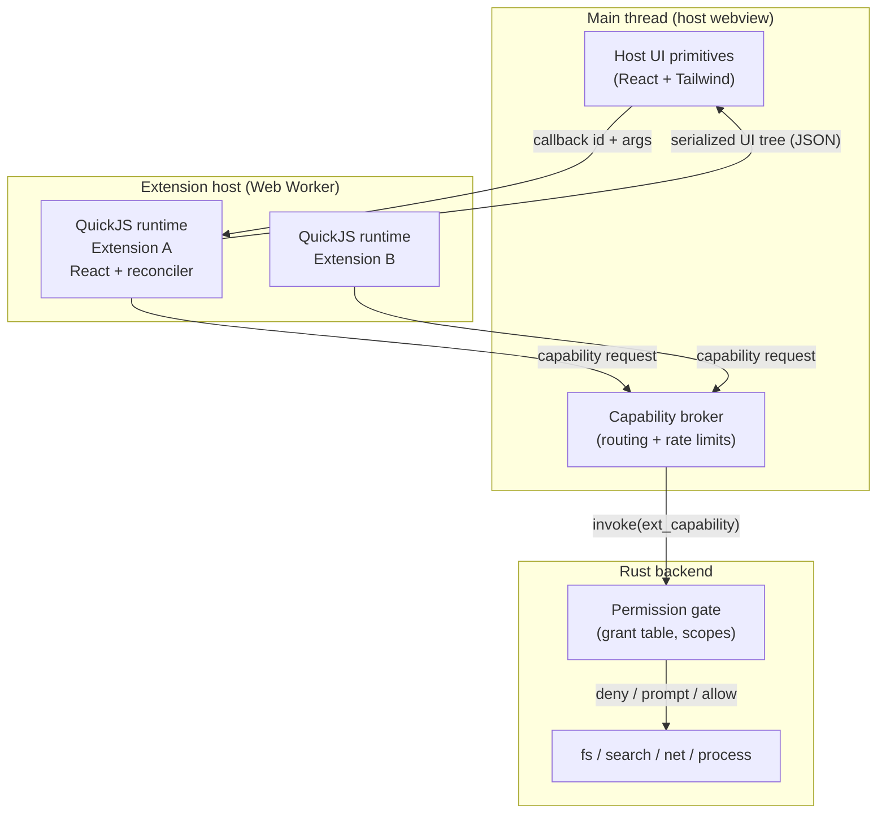

# Extensions System Spec

## Summary

A TypeScript extension system for Writer, modelled on Raycast's authoring experience but with real isolation. Extensions are authored in TypeScript/React, distributed from GitHub repositories, and execute inside a per-extension JavaScript VM that has **no ambient host access**. Every capability that touches the user's machine — reading notes, writing files, network — is a host-provided function gated by a declared manifest permission and an explicit user grant enforced in Rust.

> **Revised during implementation.** AI is no longer a host capability. See [AI Chat](#ai-chat-first-core-extension) for what replaced it and why.

The design goal, stated plainly: **an installed extension must not be able to do anything harmful without the user having approved that specific class of action.**

## Verification Status

The two load-bearing technical bets were spiked before writing this plan, not assumed. All measurements below are from `quickjs-emscripten@0.32.0` + `react@19` + `react-reconciler@0.33.0` on this machine.

**Isolation spike — 8/8 pass:**

| Property                                                  | Result                                                                                      |
| --------------------------------------------------------- | ------------------------------------------------------------------------------------------- |
| Runaway `while(true)` halted by interrupt handler         | ✅ stopped at ~205ms against a 200ms deadline                                               |
| Guest heap memory cap enforced                            | ✅ allocation fails past `setMemoryLimit`                                                   |
| No ambient host globals                                   | ✅ `process`, `fetch`, `require`, `window`, `XMLHttpRequest`, `WebAssembly` all `undefined` |
| Host capability call + argument/return marshalling        | ✅                                                                                          |
| Module loader allow/deny                                  | ✅ `@writer/api` resolved, `node:fs` rejected (default-deny)                                |
| Async host bridge (host promise → guest `await`)          | ✅                                                                                          |
| Cross-runtime isolation (ext A global invisible to ext B) | ✅                                                                                          |
| Cost                                                      | `newRuntime + newContext` ≈ **0.20ms**; building a 50-item tree 200× ≈ **9–11ms**           |

**UI spike — pass.** A React extension bundled to 430KB was loaded into the VM and driven end to end:

- Parse + evaluate the React bundle inside the VM: **~40–46ms** (one-time, per extension launch)
- Mount + `useEffect` + host capability call + commit: **~65ms**
- Three commits crossed the boundary as JSON (`loading` → 4 items → filtered to 1)
- A host-side callback (`onSearchTextChange`) round-tripped into the guest and produced a correct re-render

**Conclusion: we do not have to trade the Raycast UI model against isolation.** React runs _inside_ the sandbox; only a serialized tree crosses out. Host functions were separately proven reusable (6/6 calls), so the capability model is sound.

### Hazards found during the spike (design constraints, not blockers)

These cost real debugging time and are now encoded as requirements:

1. **`ctx.dump()` does not deep-serialize object graphs** — it returns `"[object Object]"`. The guest must `JSON.stringify` explicitly. This is a feature, not a workaround: it forces one explicit serialization boundary.
2. **`react-reconciler` has unstable internals.** In 0.33 the signature is `commitUpdate(instance, type, oldProps, newProps, fiber)`; passing the wrong positional arg serialized React's internal fiber and produced a circular reference that silently broke every commit after the first. **Requirement:** pin the version exactly, and add a contract test that asserts a committed tree is JSON-serializable.
3. **Props must be allowlisted, not copied.** Only primitives, plain objects, arrays, and functions (converted to callback IDs) may cross. Everything else is dropped.
4. **There is no ambient event loop in the VM.** The host must pump `executePendingJobs()` and the reconciler's `flushPassiveEffects()`. Timers must be host-provided.
5. **Handles require manual disposal.** Leaking one aborts the WASM module on `dispose()` with a GC assertion. All handle use must go through a scope helper.
6. **WebKit enforces CSP for WebAssembly.** The app's original CSP produced `CompileError: Refused to create a WebAssembly object`. **Requirement:** `tauri.conf.json` must include `'wasm-unsafe-eval'` in `script-src` and `worker-src 'self'`. Workers inherit CSP from their _own_ response, not the parent document. Verified in the shipped WKWebView by `apps/desktop/e2e/specs/extension-vm.spec.js`.
7. **React 19 removed legacy mode.** The container must be created with `ConcurrentRoot`; a `LegacyRoot` tag never schedules updates. `updateContainer` alone still never renders inside the VM, so `resolveUpdatePriority` is pinned to `DiscreteEventPriority` to keep all work on the sync lane.
8. **React's scheduler binds its host callback at module init**, preferring `setImmediate`, then `MessageChannel`, then `setTimeout`. QuickJS has none of these, so the host **must** inject `setTimeout`/`clearTimeout` _before_ evaluating the bundle. Node's `setImmediate` masks this in tests; the test environment deletes it so the failure stays honest.
9. **QuickJS does not drain promise reactions when the host stack unwinds.** A capability can resolve with correct data and the guest's `.then` still never runs. The host must call `runtime.executePendingJobs()` after every guest entry point.
10. **In-flight capability calls are not "pending work".** They wait on the host, so a render-settling loop cannot advance them; counting them burns the whole loop budget on every render that has an outstanding request.
11. **Depth limits are not cycle detection.** A cycle nested within the depth limit produces a plausible-looking truncated copy instead of an error. Prop sanitization must track the path and reject the whole prop.

## Goals

- Extensions authored in TypeScript/React with a Raycast-style component API.
- Hard isolation: extensions cannot reach the host DOM, the host's Tauri IPC, the filesystem, or the network except through granted capabilities.
- Extension-to-extension isolation by default, with opt-in shared storage.
- Install directly from any GitHub repository; official extensions from a registry in this repo.
- Updates tracked against GitHub Releases of the extension's own repo.
- Private extensions = private repos; the installing user must have access.
- A first-party AI Chat extension that can search, read, and reason over the user's notes.

## Non-Goals

- Arbitrary HTML/CSS/JS extension UI. Extensions get host-owned primitives only. This is the deliberate constraint that makes the UI safe and keeps extensions visually consistent — the same trade Raycast makes.
- Native code / NPM native modules inside extensions.
- A paid marketplace, ratings, or telemetry.
- Extensions modifying the editor's core rendering pipeline (no CodeMirror extension injection in v1).

## Architecture



### Why this shape

**One dedicated Web Worker hosting N QuickJS runtimes.** This mirrors VS Code's extension host. The worker keeps runaway extension code off the UI thread (the interrupt handler bounds a loop at ~200ms, but that would still be a 200ms UI freeze on the main thread). `worker.terminate()` provides a hard kill when the cooperative interrupt is insufficient. Per-extension isolation comes from separate QuickJS runtimes, which are cheap (0.20ms) and provably cannot see each other's state; the 505KB WASM module is instantiated once and shared.

**The permission gate lives in Rust, not TypeScript.** The webview is not a trust boundary — Tauri's own docs are explicit that capabilities do not protect against malicious code with DOM/JS access in the same webview. Putting the check in Rust means that even a fully compromised webview cannot read a file the user never granted. The TS-side broker is an optimization and a UX layer, never the enforcement point.

**UI is host-rendered from a serialized tree.** The extension's React tree never becomes DOM. The host receives JSON and renders it with its own components, so an extension cannot inject markup, scripts, styles, or exfiltrate via an ``.

## Extension Authoring

### Manifest (`writer.json`)

> The example below is the **shipped** `extensions/ai-chat/manifest.json`, kept in sync
> with the real file rather than idealised.

```json
{
  "id": "writer.ai-chat",
  "name": "AI Chat",
  "version": "0.1.0",
  "description": "Ask questions about your notes using an AI agent you already have installed. Answers are grounded in your own writing, with sources you can open.",
  "author": "writer",
  "icon": "message",
  "commands": [
    {
      "name": "chat",
      "title": "Chat With Your Notes",
      "subtitle": "Ask questions grounded in what you've written",
      "mode": "view"
    }
  ],
  "permissions": {
    "capabilities": [
      {
        "name": "unsafe",
        "reason": "Starts the AI assistant you choose (GitHub Copilot, Claude Code, Codex, or Gemini) as a separate program on your computer. That program runs with your full account access and Writer cannot restrict what it does."
      },
      { "name": "workspace", "read": ["**/*.md"] },
      { "name": "storage", "shared": false }
    ],
    "usesServices": ["search"],
    "providesServices": []
  },
  "preferences": [
    {
      "name": "harness",
      "title": "AI assistant",
      "type": "dropdown",
      "default": "copilot",
      "options": ["copilot", "claude", "codex", "gemini"],
      "description": "Which locally installed agent to use. It must already be installed and signed in."
    },
    {
      "name": "contextNotes",
      "title": "Notes to retrieve per question",
      "type": "dropdown",
      "default": "6",
      "options": ["3", "6", "10"],
      "description": "More context gives better answers but costs more tokens."
    }
  ]
}
```

Design decisions, and why:

- **`capabilities` is a closed set with explicit scopes.** Following Figma's `networkAccess.allowedDomains` and Chrome's `host_permissions`: a domain allowlist, not a boolean. `"domains": []` means no network at all, which is the default.
- **`reason` is mandatory for any non-ambient capability** and is shown verbatim in the consent dialog. Figma requires this for wildcards; we require it for everything, because an unexplained request is a signal in itself.
- **Version is in the manifest and is the update key.** Obsidian's model: the release tag must equal `manifest.version`.
- **`minWriterVersion` gates installs** against API drift.

### Capability tiers

| Tier         | Capabilities                                                                                      | Consent                                                              |
| ------------ | ------------------------------------------------------------------------------------------------- | -------------------------------------------------------------------- |
| Ambient      | own storage, own preferences, UI render, log                                                      | none — cannot touch user data                                        |
| Install-time | `workspace.read` (glob-scoped), `network.domains` (explicit list), `embeddings`, `clipboard.read` | granted once at install, shown with reasons                          |
| Runtime      | `workspace.write`, `workspace.delete`, `network.domains: ["*"]`                                   | prompted on first use, with "allow once / always / deny"             |
| **Unsafe**   | `unsafe` → `process.spawn` and friends                                                            | separate dialog, styled apart, with its own acknowledgement checkbox |

**The `unsafe` tier is a trust decision, not a scope check.** Everything above it is
scope-checked: a `workspace.read` grant physically cannot reach outside its globs, because
Rust refuses. `unsafe` has no equivalent — it starts a program that runs as the user, which
Writer cannot inspect, restrict, or revoke once running. There is deliberately **no program
allowlist**: a permitted interpreter runs arbitrary code and a permitted shell runs anything,
so a partial gate would imply a guarantee that does not exist. It is all-or-nothing behind
explicit consent, with the extension's stated reason shown verbatim.

**Scopes are enforced in Rust against the canonicalized real path**, after symlink resolution, and must remain inside the workspace root. A `read: ["**/*.md"]` grant cannot escape via `../` or a symlink into `~/.ssh`.

### Inter-extension services

The spec originally shared only _storage_ between extensions, which is not enough: the
semantic-index extension has to expose _query_ to AI Chat. A `services` capability closes
that gap.

- A provider declares `permissions.providesServices: ["search"]`.
- A consumer declares `permissions.usesServices: ["search"]`.
- The broker routes consumer → provider, and the user consents to the link at install time.

Two rules make this safe to add. A service call is **not** an authority grant: the provider
runs with its own permissions, never the caller's, so a consumer cannot borrow a capability
it was not granted. And a provider failure is delivered to the consumer as a normal refusal
(`{ ok: false, code }`), never as an exception, so one extension can never take another down.

**Embeddings are a Rust capability, not a library.** sqlite-vec is a native SQLite extension
and embedding inference is native code; neither can run in QuickJS. The guest sees an async
capability; Rust owns the implementation.

**The embedding model is downloaded, not bundled.** Writer uses
[potion-base-8M](https://huggingface.co/minishlab/potion-base-8M) (MIT, 256-wide) via
[`model2vec-rs`](https://crates.io/crates/model2vec-rs) - static embeddings that need no ONNX
runtime and therefore no dynamic library, which keeps macOS notarization simple. Weights are
~31 MB, fetched on explicit user action from Preferences rather than on first launch, because a
local-first editor should not silently reach out to the network the first time someone opens a
notes folder.

Until the model is present the index falls back to a bag-of-words hash embedder. This has _no_
semantic ability, so the fallback is reported in Preferences rather than hidden - a silent
downgrade would read to a user as the feature being poor rather than switched off. Note the two
embedders have different widths (384 vs 256), so the vec0 table records its width and rebuilds
when it changes; the index is a derived cache and every row is recomputable from the notes.

Model2Vec must be built with the `fancy-regex` feature. The default `onig` feature links a C
regex library, which would reintroduce exactly the native-dependency problem this choice avoids.

### Guest API surface

```typescript
import { List, ActionPanel, Action, showToast, workspace, storage } from "@writer/api";

export default function Command() {
  const [notes, setNotes] = useState<Note[]>([]);

  useEffect(() => {
    // Rejects at the Rust gate unless workspace.read was granted.
    workspace.search("tauri").then(setNotes);
  }, []);

  return (
    <List isLoading={!notes.length} onSearchTextChange={setQuery}>
      {notes.map((n) => (
        <List.Item
          key={n.path}
          title={n.title}
          subtitle={n.path}
          actions={
            <ActionPanel>
              <Action.OpenNote path={n.path} />
              <Action.CopyToClipboard content={n.path} />
            </ActionPanel>
          }
        />
      ))}
    </List>
  );
}
```

### UI primitives (host-owned)

Ported conceptually from Raycast, rendered with Writer's existing Tailwind/CSS-variable theming so extensions inherit the user's theme automatically:

- `List`, `List.Item`, `List.Section`, `List.EmptyView`, `List.Dropdown`
- `Detail` (markdown, rendered through the app's existing renderer + DOMPurify), `Detail.Metadata`
- `Form` + `TextField`, `PasswordField`, `TextArea`, `Dropdown`, `Checkbox`, `TagPicker`, `FilePicker`
- `Grid`
- `ActionPanel`, `Action`, `Action.Submenu`, and built-ins (`OpenNote`, `CopyToClipboard`, `OpenInBrowser`, `SubmitForm`, `Push`, `Pop`)
- Writer-specific: `Chat` (message list + composer + streaming), `NotePreview`

Feedback APIs: `showToast`, `showHUD`, `confirmAlert`, `useNavigation()`.

**Surfaces** an extension command can occupy: `palette` (existing cmdk palette), `panel` (right-hand dock), `sidebar` section, `editor-action` (context menu).

### Build toolchain

`writer-ext` CLI (thin wrapper over esbuild, following `ray build`):

- `writer-ext dev` — watch, rebuild, hot-reload into a running Writer with a `[dev]` badge
- `writer-ext build` — bundle to a single ESM `extension.js`, externalize `@writer/api`
- `writer-ext validate` — manifest schema, capability/reason completeness, bundle size, serializability contract test
- `writer-ext package` — emit release assets

Bundle output is exactly two required files: `manifest.json` and `extension.js`.

## Distribution and Updates

Deliberately Obsidian's model — **no CDN, no Writer-operated servers** — because it keeps user-hosted and official extensions on one code path.

**Official registry:** `registry/extensions.json` in this repo, listing `{ id, name, author, description, repo }`. It is a lookup table only; the authoritative version always lives in the extension's own repo.

**Third-party install:** the user enters `owner/repo` directly. Same install path, different entry point.

**Update check:**

1. `GET https://api.github.com/repos/{repo}/releases` (or `/releases/latest`)
2. Read `manifest.json` from the release assets; the release tag must equal `manifest.version`
3. Reject if `minWriterVersion` exceeds the running app version
4. Download `manifest.json` + `extension.js`
5. Record `sha256` of the bundle at install; on update, show the version delta

**Private extensions:** the user supplies a fine-grained GitHub PAT. Private assets are fetched via `GET /repos/{owner}/{repo}/releases/assets/{id}` with `Accept: application/octet-stream`. Access is enforced by GitHub — if the user can't read the repo, they can't install it. The token is stored in the OS keychain (`keyring`, service `app.writer.extensions`), never in settings JSON, and is only ever sent to `api.github.com`.

The token is also never handed to the frontend. `extension_install_resolve` reads it from the keychain itself rather than accepting it as an argument, and there is no command to read it back — the UI can save, clear, and ask _whether_ one exists. This matters because the WebView that would otherwise hold the token is the same WebView that renders extension UI code.

The asset endpoint is used rather than `browser_download_url` because the latter is unauthenticated and fails for private repos; using one path for both means the private case is exercised by every public install.

**Permission diffs on update are mandatory.** If v2 requests a capability v1 did not have, the update does not auto-apply; the user sees a diff and must re-consent. This is the single most important supply-chain control in the design — it turns "the extension you trusted quietly gained network access" into an explicit decision.

Updates are checked on launch and on demand, never applied silently when permissions change.

## AI Chat (first core extension)

**This section was rewritten during implementation. The original design was wrong twice over**,
and both corrections came from running code rather than reading docs.

### What the original spec said, and why it was abandoned

The spec proposed an `ai` capability implemented in Rust with `github-copilot-sdk`, on the
reasoning that the TypeScript `@github/copilot-sdk` depends on `koffi` (native FFI) and
cannot run in a webview. That premise is still true. The conclusion was not.

Two problems killed it:

1. **It hard-wires one vendor into the host.** Every extension wanting a different assistant
   would need a change to Writer itself. AI tooling changes on a far shorter cycle than a
   desktop app ships.
2. **It puts a network-talking, process-spawning integration inside the trusted host**, where
   it is exempt from the permission model the rest of the system is built on. The component
   most likely to need scrutiny would have been the one component nobody could gate.

### What replaced it

**The host provides no AI capability at all.** It provides generic child-process primitives —
`process.which`, `spawn`, `write`, `read`, `kill` — behind the `unsafe` tier. An extension
that wants an assistant brings its own integration and declares `unsafe`, which forces a
distinct consent dialog.

AI Chat speaks the [Agent Client Protocol](https://agentclientprotocol.com) (ACP), and the
**entire ACP client is TypeScript running inside the sandbox** (`extensions/ai-chat/src/acp/`).
Nothing about it is privileged; it is ordinary extension code that happens to have been
granted the ability to start a program.

**The one protocol fact that makes this possible:** ACP frames messages as
newline-delimited JSON, not LSP-style `Content-Length` headers. A QuickJS guest can parse
that with `split("\n")`. Verified against `agent-client-protocol` 2.0.0 crate source and
confirmed against a live agent.

**Harnesses are user-choosable**, because the protocol is the contract rather than the vendor:

| Harness        | Invocation                                            |
| -------------- | ----------------------------------------------------- |
| GitHub Copilot | `copilot --acp`                                       |
| Gemini CLI     | `gemini --experimental-acp`                           |
| Claude Code    | `npx -y @agentclientprotocol/claude-agent-acp@0.66.0` |
| Codex          | `npx -y @agentclientprotocol/codex-acp@1.1.14`        |

Versions are pinned deliberately. `@latest` is a network fetch at every launch, which hands
the publisher the ability to change what executes between one run and the next.

The preset list lives **in the extension, not in Rust**. A copy in the host would be a second
source of truth that drifts, and adding a harness must touch exactly one file.

### How the agent reaches notes

The agent asks; it does not read. ACP's `fs/read_text_file` request is routed through the
extension's own `workspace.read` capability, so the manifest's globs apply and Rust enforces
them. `session/request_permission` for write operations is declined.

**This is protocol convention, not containment, and the spec must not pretend otherwise.**
A hostile harness would read the file directly and never send the request. What actually
holds is the `unsafe` consent: the user chose to run this specific program. Verified
end-to-end — a live agent asked to write a file attempted `apply_patch`, requested
permission, was declined, and the file was never created.

### Model selection

Dropped. `session/new` returns `models.availableModels`, but ACP v1's `NewSessionRequest`
has no field to select one, so there is no portable way to act on it. Shipping a dropdown
that silently does nothing is worse than shipping no dropdown. The agent's own default applies.

### Process lifetime is host-enforced

The extension kills its agent on unmount, but that path cannot be relied on: a VM that
crashed, ran out of memory, or exhausted its CPU budget never runs cleanup — and that is
precisely the state a hostile extension would arrange on purpose. So the host reaps every
process owned by an instance when the instance is disposed, whether or not the guest
cooperated. This was a real leak found by testing disposal, not by reading the code.

**Privacy:** note content reaches the agent only through capabilities the user granted, and
only for the harness the user chose and consented to. Because the harness is a local program
the user already installed, Writer makes no claim about what it does with that content
beyond starting it — and the consent dialog says exactly that.

## Security Model — What This Does and Does Not Protect Against

Stating this explicitly, because a security model that isn't honest about its edges is worse than none.

**Protects against:**

- An extension reading notes it was never granted (Rust-side scope check on canonical paths)
- An extension exfiltrating data over the network (no `fetch` in the VM at all; host mediates and enforces the domain allowlist)
- An extension reading another extension's storage or tokens (separate runtimes, verified)
- An extension touching the host DOM, other extensions' UI, or the app's Tauri IPC (no DOM, no `window`, no `__TAURI__` in the VM)
- An extension hanging the app (interrupt handler + worker termination)
- An extension silently escalating privileges across an update (permission diff + re-consent)
- Prototype-pollution style sandbox escapes of the class that broke Figma's Realms shim (different in-memory object representation entirely)

**Does not protect against:**

- A user who grants broad permissions without reading them. Consent UI quality is a security control; treat it as one.
- Malicious content _inside_ granted scope — an extension with `workspace.read: ["**/*.md"]` and `network` genuinely can exfiltrate notes. The manifest makes that combination visible; it does not make it impossible.
- Prompt injection via note content reaching an AI agent. Mitigation: retrieved note text is clearly delimited in the prompt, and every agent-initiated write is declined. Neither is a solution; injection into an LLM has no known complete defence.
- **Anything an `unsafe` extension does once consent is given.** The program it starts runs as the user, outside the sandbox, and Writer can neither inspect nor restrict it. The `unsafe` tier is a disclosure mechanism, not a containment one, and the consent dialog is written to say so rather than to reassure.
- A malicious _host_ app update, or a compromised Rust dependency. Out of scope.
- Timing/side-channel attacks. QuickJS-in-WASM is same-process; it is not OS-level isolation and we should not claim it is.
- CPU/memory exhaustion beyond the configured budgets on a machine already under pressure.

## Implementation Phases

Each phase is independently shippable and leaves the app in a working state.

| Phase                           | Status                                                                                                                                                                                                                        |
| ------------------------------- | ----------------------------------------------------------------------------------------------------------------------------------------------------------------------------------------------------------------------------- |
| 1 — Sandbox foundation          | **Built**, test-verified                                                                                                                                                                                                      |
| 2 — UI model                    | **Built**, test-verified                                                                                                                                                                                                      |
| 3 — Permissions and preferences | **Built**, test-verified, and now reachable: installing from Preferences → Extensions shows the consent dialog. Grant _persistence_ and runtime allow-once/always prompts are still outstanding                               |
| 4 — Distribution                | **Mostly built.** Install and update by `owner/repo` from GitHub releases, permission-diff re-consent, keychain-stored PAT for private repos, uninstall. The official registry file and scheduled update checks are not built |
| 5 — AI Chat                     | **Built**, verified against a live agent                                                                                                                                                                                      |
| 6 — Polish                      | **Not started**                                                                                                                                                                                                               |

Phases 3 and 4 are coupled in practice: consent is an install-time event, so the dialog
stayed unreachable until installation existed. Both are now wired to Preferences → Extensions.

**Phase 1 — Sandbox foundation.** Extension host worker; QuickJS runtime lifecycle with memory/interrupt budgets, scope-based handle management, module loader (default-deny, only `@writer/api`). Capability broker skeleton with exactly one capability (`workspace.read`) end to end, gated in Rust. Local folder loading only, no distribution. Contract test asserting committed trees are JSON-serializable.

**Phase 2 — UI model.** React reconciler in the guest; host renderers for `List`, `Detail`, `ActionPanel`, `Action`; callback registry and event routing; `palette` and `panel` surfaces. Toast/HUD/alert. `@writer/api` package published to the workspace.

**Phase 3 — Permissions and preferences.** Full capability set; consent dialogs with reasons; grant persistence; runtime prompts with allow-once/always/deny; extension preferences UI reusing the existing settings-control registry; per-extension storage with namespacing.

**Phase 4 — Distribution.** GitHub install by `owner/repo`; official registry file; release-based update checks; permission-diff re-consent; private repo support with keychain-stored PAT; enable/disable/uninstall management UI.

**Phase 5 — AI Chat.** ACP client in TypeScript inside the sandbox; `process.*` primitives in Rust behind the `unsafe` tier; harness presets owned by the extension; streaming UI; grounding via the semantic-index service.

**Phase 6 — Polish.** Opt-in shared storage (both sides declare, user consents); `writer-ext` CLI + docs + example extension; dev-mode hot reload.

## Files Expected To Change

New packages:

- `packages/extension-api/` — guest-facing types, components, capability stubs (`@writer/api`)
- `packages/extension-host/` — VM lifecycle, capability broker, reconciler host, worker entry
- `packages/extension-cli/` — `writer-ext` build/dev/validate/package

Desktop frontend:

- `apps/desktop/src/components/extension-ui/` — host renderers for each primitive
- `apps/desktop/src/components/extension-panel/` — panel surface
- `apps/desktop/src/stores/extension-store.ts` — installed/enabled/grants state
- `apps/desktop/src/components/command-palette/index.tsx` — contributed commands
- `apps/desktop/src/components/settings-panel/` — Extensions settings section

Rust backend:

- `apps/desktop/src-tauri/src/extensions/{mod,registry,installer,permissions,capabilities,github,process,which}.rs`
- `apps/desktop/src-tauri/src/lib.rs` — command registration

Shared / docs:

- `apps/desktop/src-tauri/src/extensions/manifest.rs` — **the** manifest contract. The Rust
  structs are the schema; serde enforces shape, `validate()` enforces rules, and
  `describe_permissions()` produces the consent wording. All three live together so the
  sentence a user reads is derived by the same module that grants the permission.
  A hand-written `extension.schema.json` was tried and deleted: nothing consumed it, and it had
  already drifted far enough to reject the shipped `writer.ai-chat` manifest. If an
  author-facing JSON Schema is wanted for editor autocomplete it must be _generated_ from these
  structs (e.g. `schemars`), never maintained alongside them.
- `registry/extensions.json`
- `docs/extensions.md`, `docs/extension-authoring.md`

## Acceptance Criteria

- An extension loaded from a local folder renders a `List` in the command palette and opens a note via an `Action`.
- An extension without `workspace.read` receives a rejection when calling `workspace.search`, and the rejection originates in Rust, not TypeScript.
- An extension cannot reach `window`, `document`, `fetch`, `__TAURI__`, or another extension's storage — asserted by tests.
- A `workspace.read: ["notes/**"]` grant cannot read `../secrets.md` or follow a symlink outside the workspace — asserted by tests.
- An infinite loop in an extension does not freeze the UI and is terminated.
- Installing `owner/repo` fetches the latest release, shows a consent dialog listing every capability and its reason, and installs on approval.
- An update that adds a capability blocks until the user re-consents; an update that does not, applies cleanly.
- A private repo installs for a user with access and fails cleanly for one without.
- AI Chat answers "what did I write about X?" with citations linking to real notes, using only granted scopes.
- Disabling an extension immediately tears down its VM; uninstalling removes its storage and grants.

## Open Questions

1. **Extension-contributed editor decorations.** Genuinely useful (custom code-block renderers) but would mean handing extensions a CodeMirror surface, which is hard to sandbox. Deferred past v1; revisit with a narrow "block renderer returns a serialized tree" design.
2. **Bundling React per extension.** 430KB of React in every bundle is wasteful when the host already has it. Options: externalize React and inject a host-provided copy into the VM (saves size, couples versions), or accept the duplication (simpler, isolated). Measure first — 46ms load was acceptable in the spike.
3. **Signing official extensions.** TOFU + permission diffs are proposed for v1. Sigstore/minisign for registry extensions is a natural follow-up.
4. **Windows/Linux.** The design is platform-neutral, but `which.rs` resolves programs by running the user's login shell to recover its `PATH`, which is POSIX-specific and needs a Windows equivalent.
5. **Worker + WASM in WKWebView.** quickjs-emscripten is confirmed working in browsers and Node; it was **not** verified inside Tauri's WKWebView specifically. Phase 1 must start with that smoke test, since an asm.js fallback variant exists if WASM is unavailable.
